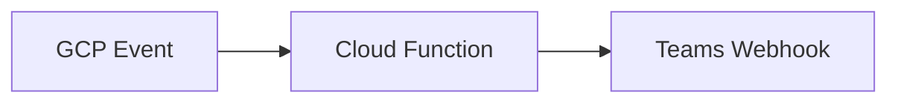

# GCP → Microsoft Teams Alerts
Pub/Sub → Cloud Function → Teams webhook with Adaptive Cards.

## Architecture


## Deploy
```bash
gcloud functions deploy teamsAlerts --runtime python312 --trigger-topic alerts --set-secrets "TEAMS_WEBHOOK=projects/xxx/secrets/teams"
```

## Outcome
- Alerts routed to Teams with key facts for triage
